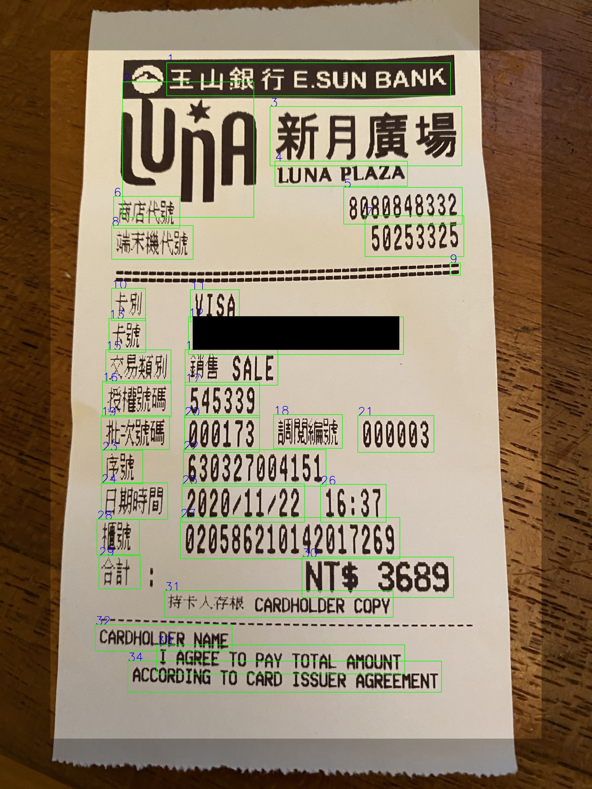

# ticket-ocr-demo
*Task: parse the chinese, english and arabic numbers from a receipt or train ticket 

### Examples contained in this repository 
* High Speed Railway Ticket 

1. Parsed Text:2020/11/19

2. 車次 Train826

3. Parsed Text:單程票

4. 南港

5. 台中13:36

6. 14:50

7. Taichung

8. Nangang

9. 13C

10. 標準廂

11. 座位

12. 3

12. Std. Car

14. Seat

15. 成人

16. 01516326

17. 信用卡

18. 乘客1

19. NT$750

20. 07-1-09-0-324-0173

21. Parsed Text:2020/11/19 發行

* Receipt 

* Receipt details 

